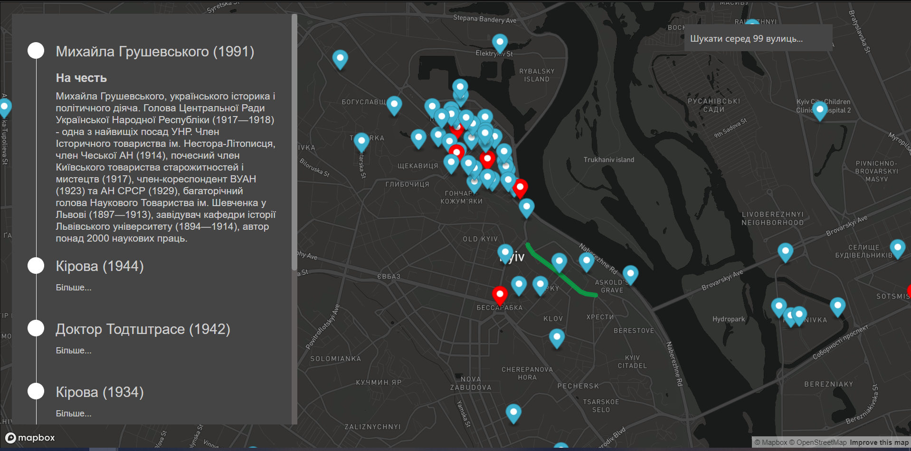
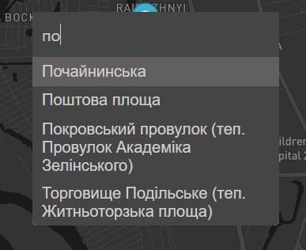

## Код сайту [vulytsi.name](http://www.vulytsi.name), де зібрана інформація щодо сучасних та колишніх назв вулиць/площ міста Києва

Для кожної вулиці (як для сучасної назви так і для колишніх) є інформація на честь кого/чого вона названа. Присутній пошук за назвоб як сучасною, так и колишньою

Майбутні плани:
- теги (декомунізація, дерусифікація...)
- додати адаптивність (мобільна версія сайту)
- кластеринг великого скупчення маркерів
- додати https